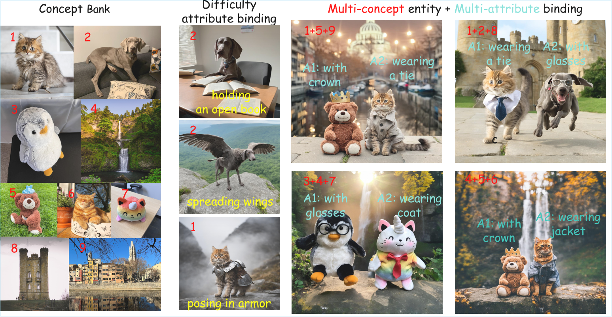
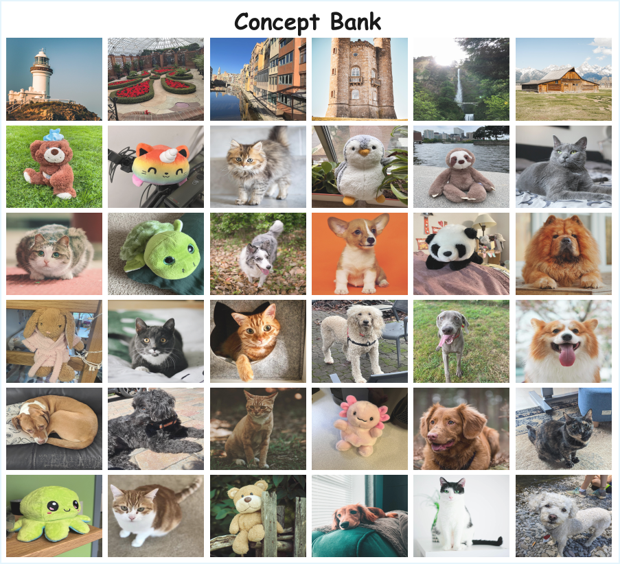

# MultiCompose: Multi-Concept Personalized Composition with Per-Subject Attribute Binding (ACM MM2026)

Official implementation of **MultiCompose**, a framework for composing multiple personalized subjects while binding user-specified attributes to the correct subject.

<p align="center">
  <a href="https://arxiv.org/abs/2608.03708">Paper</a> ·
  <a href="https://github.com/I2-Multimedia-Lab/MultiCompose">GitHub</a>
</p>

## Overview

Personalized text-to-image models can preserve a concept from a few reference images, but composing several personalized subjects in one scene introduces two coupled problems: identity degradation and per-subject attribute misalignment. MultiCompose separates concept personalization from multi-subject composition through:

- semantic-preservation regularization during concept personalization;
- a two-phase inference procedure for layout establishment and composition;
- spatially exclusive subject masks and attention control;
- a dual-path evaluation protocol for identity fidelity and attribute binding.

The evaluation code includes both a structured VLM judge and conventional DINOv2/CLIP measurements. The repository contains runnable method code and public configuration templates. Private checkpoints, datasets, generated result collections, and experiment-specific selections are intentionally not included.

## Paper

**MultiCompose: Multi-Concept Personalized Composition with Per-Subject Attribute Binding**  
Ruirui Zhang, Zhengkai Zhao, Pan Gao  
Accepted at ACM Multimedia 2026.

- [arXiv:2608.03708](https://arxiv.org/abs/2608.03708)
- [PDF](https://arxiv.org/pdf/2608.03708)

### Teaser

[](assets/fig_teaser.pdf)

### Concept bank

[](assets/fulu1.pdf)

## Repository layout

```text
.
├── assets/       # README figures only
├── configs/      # public TSV configuration templates
├── training/     # single-concept and batch training entry points
├── inference/    # single-case, batch, and layout-guided inference
├── box/          # VLM layout-box generation and validation
├── evaluation/   # VLM, DINOv2/CLIP, and combined evaluation
├── source/       # core training, sampler, and batch-evaluation code
├── environment.yml
└── requirements.txt
```

## Installation

```bash
git clone https://github.com/I2-Multimedia-Lab/MultiCompose.git
cd MultiCompose

conda env create -f environment.yml
conda activate multicompose
```

Alternatively:

```bash
pip install -r requirements.txt
```

The released code expects a local or Hugging Face-compatible SDXL base model, concept image directories, and personalized checkpoints. These assets are not bundled with the repository.

## Configuration templates

Copy the templates and replace the placeholders with your own paths:

```bash
cp configs/concepts.example.tsv configs/concepts.tsv
cp configs/inference_cases.example.tsv configs/inference_cases.tsv
```

`concepts.tsv` defines `concept_id`, modifier tokens, class prompts, dataset directories, and checkpoint paths. `inference_cases.tsv` defines the two subjects, background, attributes, action, external boxes, and seed for each inference case.

## Training

### One concept

`source/training/train_personalized_concept.py` is the training implementation. The following is the executable wrapper:

```bash
MODEL_NAME=/path/to/stable-diffusion-xl-base-1.0 \
DATASET_DIR=/path/to/datasets/subject_a \
CONCEPT_ID=subject_a \
INSTANCE_PROMPT='Photo of a <subject_a> object.' \
MODIFIER_TOKEN='<subject_a>' \
bash training/train.sh
```

The wrapper passes the training arguments to `accelerate launch` and runs the job. Use `training/train_demo.sh` when you only want to inspect the generated command without starting training.

### Batch training

```bash
MODEL_NAME=/path/to/stable-diffusion-xl-base-1.0 \
CONFIG_FILE=configs/concepts.tsv \
OUTPUT_ROOT=/path/to/checkpoints \
bash training/train_all.sh
```

The batch launcher reads the TSV row by row and invokes the same single-concept training implementation for every row.

## Inference

The main sampler is `source/inference/multiconcept_sampler.py`. It implements the two-subject composition path with external boxes, resampling, spatial attention control, and per-concept checkpoint loading.

### One case

```bash
MODEL_NAME=/path/to/stable-diffusion-xl-base-1.0 \
MAPPING_FILE=configs/concepts.tsv \
THEME1=subject_a THEME2=subject_b BACKGROUND=background_scene \
ATTR1=attribute_one ATTR2=attribute_two ACTION=standing \
EXTERNAL_BOXES='120,220,500,960+540,220,920,960' \
bash inference/infer.sh
```

### Batch inference

```bash
MODEL_NAME=/path/to/stable-diffusion-xl-base-1.0 \
MAPPING_FILE=configs/concepts.tsv \
CASES_FILE=configs/inference_cases.tsv \
OUTPUT_ROOT=/path/to/generated-images \
bash inference/infer_all.sh
```

### VLM layout boxes

`box/vlm_layout_boxes.py` asks an OpenAI-compatible VLM for one ordered full-subject box per foreground entity, validates the JSON response, clips coordinates to the image, and converts the result to the sampler's external-box format.

```bash
VLM_IMAGE=/path/to/layout-preview.png \
SUBJECT_A='first object' SUBJECT_B='second object' \
VLM_ENDPOINT=http://127.0.0.1:8000/v1/chat/completions \
VLM_MODEL=your-vlm-model VLM_API_KEY=your-key \
MODEL_NAME=/path/to/stable-diffusion-xl-base-1.0 \
MAPPING_FILE=configs/concepts.tsv \
THEME1=subject_a THEME2=subject_b BACKGROUND=background_scene \
bash inference/infer_with_layout_boxes.sh
```

For an offline format check:

```bash
bash box/layout_box_demo.sh
```

## Evaluation

### VLM evaluation

The VLM evaluator receives four images: subject A reference, subject B reference, background reference, and the generated image. It returns a structured 100-point deduction report covering concept recall, cross-subject disentanglement/attribute binding, and identity/background fidelity.

```bash
GENERATED_IMAGE=/path/to/generated.png \
SUBJECT_A_REF=/path/to/subject_a.jpg \
SUBJECT_B_REF=/path/to/subject_b.jpg \
BACKGROUND_REF=/path/to/background.jpg \
SUBJECT_A=subject_a SUBJECT_B=subject_b BACKGROUND=background_scene \
PROMPT='photo of subject_a and subject_b in background_scene' \
VLM_ENDPOINT=http://127.0.0.1:8000/v1/chat/completions \
VLM_MODEL=your-vlm-model VLM_API_KEY=your-key \
bash evaluation/eval_vlm.sh
```

For directory-scale evaluation, set `RESULTS_ROOT`, `REF_IMAGE_DIRS`, `OUTPUT_DIR`, and the VLM environment variables, then run:

```bash
RUN_EVAL=1 RESULTS_ROOT=/path/to/generated-images \
REF_IMAGE_DIRS=/path/to/reference-images:/path/to/datasets \
VLM_API_KEY=your-key bash evaluation/batch_vlm_eval.sh
```

### Traditional DINOv2 + CLIP evaluation

`evaluation/traditional_evaluator.py` measures DINOv2 identity similarity, CLIP prompt alignment, correct attribute binding, swapped-attribute confusion, and background alignment. Ordered subject boxes can be supplied through `BOXES`.

```bash
GENERATED_IMAGE=/path/to/generated.png \
SUBJECT_A_REF_DIR=/path/to/subject_a_refs \
SUBJECT_B_REF_DIR=/path/to/subject_b_refs \
BACKGROUND_REF_DIR=/path/to/background_refs \
SUBJECT_A=subject_a SUBJECT_B=subject_b \
ATTR_A=attribute_one ATTR_B=attribute_two BACKGROUND=background_scene \
PROMPT='photo of subject_a and subject_b in background_scene' \
BOXES='120,220,500,960+540,220,920,960' \
bash evaluation/eval_traditional.sh
```

### Combined report

The combination script keeps both raw evaluation paths and optionally computes a weighted summary:

```bash
VLM_JSON=runs/evaluation/vlm.json \
TRADITIONAL_JSON=runs/evaluation/traditional.json \
bash evaluation/eval_combined.sh
```

Use the `*_demo.sh` scripts to inspect command construction without loading a model or calling an API.

## Citation

```bibtex
@article{zhang2026multicompose,
  title   = {MultiCompose: Multi-Concept Personalized Composition with Per-Subject Attribute Binding},
  author  = {Zhang, Ruirui and Zhao, Zhengkai and Gao, Pan},
  journal = {arXiv preprint arXiv:2608.03708},
  year    = {2026},
  url     = {https://arxiv.org/abs/2608.03708}
}
```

## License

The code is released under the MIT License. See [LICENSE](LICENSE).
